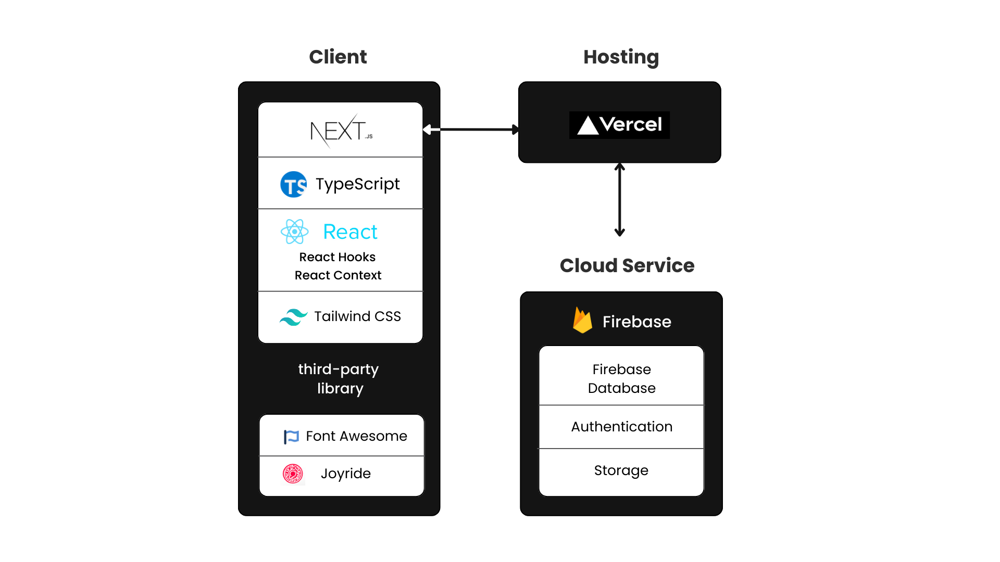

# [BeatBridges Project](https://beat-bridges.vercel.app/)

BeatBridges is an integrative platform designed to streamline the search for performance spaces, foster member reviews, and facilitate engaging interactions. With the ability to browse public pages, members can interact through comments, enhancing community links and friendships.

## Frontend Technique

- **React**
  - **Hooks** : Utilize `useState` for state management within components, `useEffect` for side effects operations, and `useContext` to access React Context, which is a way to manage global state across the component tree without prop drilling.

- **TypeScript**

- **Next.js**
- **Vercel**

- **Firebase**
  - **Firestore Database**
  - **Authentication**
  - **Storage**
    
- **Tailwind CSS**

## Architecture

## Component Tree

App
│
├───UserProvider (Manages global user state, provides UserContext)
│ │
│ └───JoyrideProvider (Manages guided processes based on user state)
│ │
│ └───Layout (Structural component typically including header and footer)
│ │
│ ├───Navbar (Navigation bar component, accesses UserContext)
│ │
│ └───Main Content (Main content area, dynamically displays based on current route)
│ │
│ ├───IndexPage (Home page)
│ ├───MapPage (Map page, contains components like Taiwan, ReviewForm, ReviewList, LocationInfo)
│ │ ├───Taiwan (Taiwan map component)
│ │ ├───ReviewForm (Review form component)
│ │ ├───ReviewList (Review list component)
│ │ └───LocationInfo (Location information component)
│ │
│ └───[username]Page (Personal page, displays components like Modal, FavoriteReviews)
│ ├───Modal (Modal dialog component for user profile editing)
│ └───FavoriteReviews (Favorite reviews component)
│
└───Shared Components (Shared components)
├───Nav (Navigation component)
└───LoginModal (Login modal, globally triggered)
└───SignupModal (Signup modal, globally triggered)

## Highlights

- **User-Focused Features**: Emphasizes user interaction with a community-based platform similar to popular social media experiences.
- **Personalized User Context**: Leverages React Context to manage and personalize user experience efficiently.
- **Real-Time Interaction**: Implements Firebase real-time database features to sync user interactions instantly.
- **Authentication and User Info**: Integrates Firebase Authentication and user information storage for a secure and personalized user experience.

## Feature Description

### User Profile Customization
Members can create a personalized profile, which becomes a central part of their experience on BeatBridges. 

- **Profile Information**: Set up a comprehensive user profile including a bio, profile picture, and other personal details.
- **Favorites**: Users can save their favorite venues and events, organizing them by the date added, offering an experience akin to social media platforms like Instagram.

### User Authentication and Context Management
Through the use of React's Firebase hooks and context system, BeatBridges provides a secure and customized user experience.

- **Authentication**: Secure user authentication process using Firebase, providing peace of mind and a tailored user experience.
- **User Context**: Synchronizes user state across the application using React Context, ensuring a consistent and efficient user experience.

### Interactions and Community Engagement
BeatBridges puts a strong emphasis on community engagement, allowing users to connect and share their experiences.

- **Comments and Interaction**: Users can comment on venues and engage with other community members, promoting active discussion and interaction.
- **Favorites Sorting**: Users can view their favorites sorted by the date added, providing a familiar and intuitive way to organize content, reminiscent of the 'favorites' feature on platforms like Instagram.
